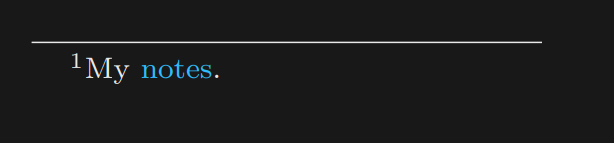
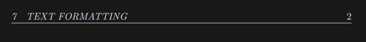

# Tex Documents Template
This project is just a template for generating documents according to my personal preferences.
You may edit the following variables to change color scheme.

## Control parameters
- `SECTIONCOLOR`
- `SUBSECTIONCOLOR`
- `SUBSUBSECTIONCOLOR`
- `PARAGRAPHCOLOR`
- `SUBPARAGRAPHCOLOR`
- `PAGECOLOR`
- `TEXTCOLOR`
- `linkcolor`

## Prerequisites
- [Pandoc](https://pandoc.org/installing.html)
- A TeX distribution (either of the following)
    - [TeX live](https://www.tug.org/texlive/)
    - [MiKTeX](https://miktex.org/)

## Usage
The `<output>` can be `*.pdf` or `*.tex`.

> [!CAUTION]
> For the images, use `xelatex` engines. The other engines like `pdflatex` does not handle images effectively.

```bash
pandoc "input.md" -o <output> --template=template.tex --pdf-engine=xelatex
```

## Screenshots




